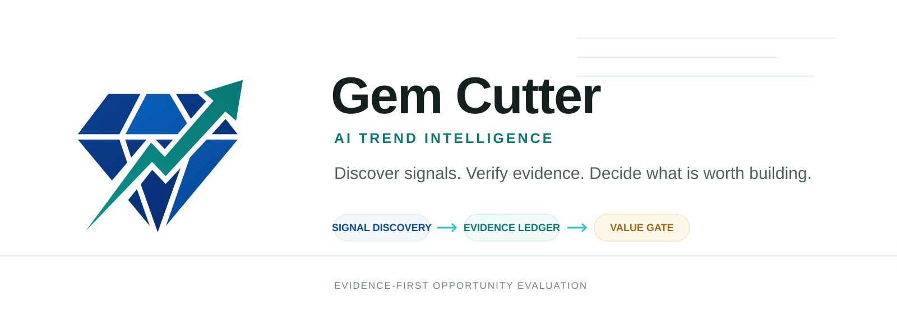

# Gem Cutter

  

> **Evidence-first AI trend intelligence and opportunity evaluation workspace**
>
> 把分散的热点信号，转换为可验证的证据、可复算的评分、明确的决策和可执行的下一步。

Gem Cutter 是一个面向本地开发的 AI 热点识别与价值评估工具。它的目标不是让大模型生成一份看起来完整的热点报告，而是建立一条可以被追溯、复核、重算和持续更新的决策链：

~~~text
热点 / 产品想法 / 技术主题
  -> 信号采集
  -> 证据标准化
  -> 主题聚合
  -> 多维评分
  -> Gate 决策
  -> 报告 / PRD / 下一步行动
~~~

当前版本已经打通一个可运行的本地垂直切片：FastAPI 后端、React + Vite 前端、SQLite 关系存储、Mock 数据源、Ark Responses API 搜索接入、证据账本、评分账本、Gate 决策、Markdown 报告和条件式 PRD 生成。

English summary: Gem Cutter is an evidence-first workspace for discovering and evaluating commercial, media, and technology trends. The current MVP focuses on an auditable pipeline from raw signals to evidence, scores, gates, reports, and PRD drafts.

## 目录

- [为什么做这个项目](#为什么做这个项目)
- [产品定位与用户价值](#产品定位与用户价值)
- [品牌资源](#品牌资源)
- [当前实现范围](#当前实现范围)
- [核心业务链路](#核心业务链路)
- [评估模型](#评估模型)
- [系统架构](#系统架构)
- [LLM 的职责边界](#llm-的职责边界)
- [本地启动](#本地启动)
- [配置](#配置)
- [API](#api)
- [存储模型](#存储模型)
- [前端工作台](#前端工作台)
- [代码地图](#代码地图)
- [测试与验证](#测试与验证)
- [当前边界与已知限制](#当前边界与已知限制)
- [演进路线](#演进路线)
- [开发原则](#开发原则)

## 为什么做这个项目

互联网热点、媒体新闻和技术趋势都在高速变化，但“热点”并不等于“机会”，高热度也不等于高可信度。用户真正需要回答的是：

- 这个主题是否真实存在，还是由少量转载或营销内容制造出来的噪音？
- 它是在增长、稳定、衰退，还是短期爆发后即将消失？
- 讨论背后是否存在明确的用户痛点、技术需求或内容机会？
- 对当前用户、市场、团队能力和时间窗口，它是否值得投入？
- 哪些结论有证据，哪些只是模型推断，哪些关键假设仍未验证？
- 下一步应该继续观察、补充调研、做用户验证、制作 Demo，还是停止投入？

Gem Cutter 将这些问题拆成结构化对象和可审计阶段，让 AI 参与语义理解与研究归纳，同时让后端负责证据约束、评分复算和状态流转。

## 产品定位与用户价值

Gem Cutter 面向以下用户：

| 用户 | 主要痛点 | 需要的结果 |
| --- | --- | --- |
| 创业者、产品经理 | 信息很多，但难以判断哪些热点值得投入 | 机会排序、证据缺口、验证建议 |
| 自媒体作者、编辑 | 发现热点慢，容易追到假热点或过时热点 | 受众匹配、时效性、内容空间、风险提示 |
| AI 工程师、技术负责人 | 新模型、新框架、新项目密集出现 | 技术成熟度、生态、集成成本和采用建议 |
| 投资人、创新部门 | 报告难比较，结论难复核 | 统一评分、来源引用、反向证据和决策记录 |
| 市场与运营团队 | 热点和用户、渠道、产品动作之间缺少连接 | 可执行实验、内容方向和监测条件 |

产品的长期方向不是一次性“热点报告”，而是：

~~~text
Signal Discovery
  信号发现

Evidence-grounded Evaluation
  证据驱动评估

Actionable Recommendation
  可执行建议

Continuous Monitoring
  持续监测与反馈闭环
~~~

## 品牌资源

Logo 系列以 `cutter.svg` 原稿为基础，保留蓝色切面与青绿色上升箭头的核心识别，并补充深浅背景、单色、应用图标、横向字标和 README 横幅版本。完整文件选择、配色和留白规范见 [品牌资源说明](assets/branding/README.md)。

## 当前实现范围

### 已实现

- 创建和查看 OpportunityProject。
- 创建 EvaluationRun，并在后台任务中执行完整评估。
- 为 7 个商业维度生成检索计划和问题。
- Mock Web / News Source Adapter，支持无 API Key 的本地运行和测试。
- Ark Responses API 集成，可通过内置 web_search 采集真实证据。
- RawSignal -> EvidenceItem -> EvidenceCluster 的标准化链路。
- URL / 标题去重、来源可信度、热度、新鲜度、相关性和情绪规则计算。
- 7 个维度的 ScoreLedger、置信度和后端 Gate 复算。
- go、conditional_go、hold、stop 四类 Gate 决策。
- Evaluation Report Markdown 生成并保存到 SQLite。
- 仅在 go 或 conditional_go 后生成 PRD。
- Ark PRD 输出通过 Pydantic schema 校验后才会写入报告。
- FastAPI REST API、OpenAPI 文档和 SSE 事件流。
- React + Vite 工作台：项目、运行、证据、评分、报告、模型日志和设置。
- Ark 调用日志持久化，可查看模型输出、推理摘要、事件数量和错误。

### 规划中

以下能力属于产品路线图或设计文档中的目标，当前代码尚未完整实现：

- 自动发现模式和定时 Watchlist。
- RSS、GitHub、arXiv、Hugging Face、官方博客等正式连接器。
- 主题实体、别名、多语言归一化和跨来源主题聚类。
- 热度时间序列、增长率、加速度、突增检测和生命周期识别。
- 自媒体热点和技术热点专用评估 Profile。
- Claim / 反向证据 / 支持关系模型。
- 人工添加证据、人工标注、Gate 覆盖和复核反馈。
- 全量 Run / Report 查询、断点续跑、取消和失败恢复。
- Postgres、pgvector、Redis 队列、对象存储和多用户权限。

## 核心业务链路

~~~text
OpportunityProject
  -> EvaluationRun
  -> EvaluationPlan
  -> RawSignal
  -> EvidenceItem
  -> EvidenceCluster
  -> ScoreLedger
  -> GateDecision
  -> EvaluationReport
  -> PRD Report
~~~

一次评估的运行阶段如下：

| 阶段 | 作用 | 主要产物 |
| --- | --- | --- |
| planning | 将主题拆成维度、问题和预算 | EvaluationPlan |
| collecting_signals | 调用来源适配器采集原始信号 | RawSignal[] |
| normalizing_evidence | 标准化字段、去重、打标签和评分属性 | EvidenceItem[] |
| clustering_evidence | 按维度聚合并生成代表证据 | EvidenceCluster[] |
| scoring | 计算 7 个维度的分数和置信度 | ScoreLedger[] |
| gate_review | 根据分数、风险和证据量做门禁判断 | GateDecision |
| rendering | 生成结构化评估报告 | EvaluationReport |
| completed | 完成运行并更新项目状态 | completed run |

当前的运行状态包括 pending、running、completed、failed、cancelled。enriching_evidence 已作为领域枚举保留，但目前增强计算发生在证据标准化阶段，没有单独的执行步骤。

## 评估模型

### 当前商业机会 Profile

当前 MVP 使用 7 个维度和固定权重：

| 维度 | 权重 | 关注问题 |
| --- | ---: | --- |
| trend_strength | 20% | 热度、增长迹象、来源覆盖和时效性 |
| user_pain | 18% | 用户痛点、抱怨、明确诉求 |
| monetization | 18% | 付费意愿、商业模式和预算信号 |
| competition_gap | 14% | 竞品密度和差异化空间 |
| execution_feasibility | 12% | MVP 技术难度、成本和周期 |
| public_opinion_risk | 10% | 舆情、版权、隐私和平台风险 |
| timing_window | 8% | 主题窗口和持续性 |

当前评分由后端规则计算。基础分综合可信度、热度和新鲜度，再根据维度语义进行调整，最终限制在 0 到 100。LLM 不负责最终算术。

### 置信度

维度置信度受到以下因素约束：

~~~text
confidence = min(
  evidence coverage,
  source diversity,
  average credibility
)
~~~

当前硬性限制：

- 某维度有效证据少于 2 条，置信度最高为 0.45。
- 某维度只有一个来源平台，置信度最高为 0.60。
- 没有有效证据时采用保守置信度 0.25。

### Gate 规则

| Gate | 当前条件 | 默认动作 |
| --- | --- | --- |
| go | 总分 >= 75、整体置信度 >= 0.68、风险维度分数 >= 55 | 允许生成完整 MVP PRD |
| conditional_go | 总分 >= 62、整体置信度 >= 0.55 | 允许生成带假设和风险项的 PRD |
| hold | 未达到以上条件，但没有触发停止条件 | 补充证据后重新评估 |
| stop | 风险维度 < 35、有效证据少于 3 条或总分 < 50 | 停止或归档当前机会 |

Gate 的总分和整体置信度由后端根据 ScoreLedger 的权重重新计算。模型返回的推荐 Gate（如果未来接入）不能直接覆盖后端结果。

### 未来 Profile

同一热点对不同用户的价值不同。后续建议将固定商业 Profile 扩展为可配置的 EvaluationProfile：

~~~text
CommercialProfile
  trend_strength, user_pain, monetization, competition_gap, ...

MediaProfile
  audience_fit, novelty, shareability, timeliness,
  fact_verifiability, copyright_risk, platform_fit

TechnologyProfile
  technical_maturity, adoption_signal, ecosystem_strength,
  integration_effort, deployment_cost, license_risk, security_risk
~~~

每种 Profile 都应同时返回分数、置信度、证据覆盖率、缺失证据、反向证据、假设和推荐动作，而不是只输出一个总分。

## 系统架构

### 当前实现

~~~text
React + Vite + TypeScript
          |
          v
FastAPI REST + SSE
          |
          v
Domain Services
  - ProjectService
  - EvaluationService
  - EvidenceService
  - ScoringService
  - ReportService
          |
          +--> Source Adapters
          |      - Mock Web
          |      - Mock News
          |      - Ark Built-in Web Search
          |      - Manual adapter placeholder
          |
          +--> SQLiteStore
                 - relational tables
                 - JSON columns for nested fields
~~~

后端拥有业务规则：创建项目、推进运行状态、证据标准化、评分复算、Gate 决策、报告保存和 PRD schema 校验。前端负责工作台交互、状态展示、轮询、SSE 事件和报告阅读。

### 目标演进架构

~~~mermaid
flowchart LR
  Sources["RSS / News / GitHub / Papers / Community"] --> Ingestion["Connector & Ingestion"]
  Ingestion --> Raw["Raw Documents / Snapshots"]
  Raw --> Normalize["Normalize / Canonicalize"]
  Normalize --> Topics["Topic & Entity Engine"]
  Normalize --> Evidence["Evidence Ledger"]
  Evidence --> Claims["Claim & Counter-evidence"]
  Topics --> Trends["Trend Time Series"]
  Claims --> Evaluate["Profile-based Evaluation"]
  Trends --> Evaluate
  Evaluate --> Decision["Gate / Recommendation / Experiment"]
  Decision --> Reports["Report / PRD / API"]
  Decision --> Alerts["Watchlist / Alerts"]
  LLM["LLM Gateway"] --> Normalize
  LLM --> Claims
  LLM --> Evaluate
  DB["Postgres + pgvector"] --> Raw
  DB --> Evidence
  DB --> Topics
  DB --> Evaluate
  UI["React Workspace"] --> API["FastAPI API"]
  API --> DB
  API --> Decision
~~~

个人开源项目建议优先保持“模块化单体 + 异步任务”的形态：先把领域边界、数据契约和评估流程做好，再在真实负载出现后引入 Redis 队列、Postgres、向量检索和对象存储，避免过早拆分微服务。

## LLM 的职责边界

Gem Cutter 的核心工程判断是：**让 LLM 处理语义不确定性，让后端处理业务确定性。**

| 任务 | 推荐负责方 |
| --- | --- |
| 生成研究问题 | LLM + 后端模板约束 |
| 识别主题、别名和实体 | LLM，结果需校验 |
| 摘要、分类、主张抽取 | LLM，结果写入结构化 schema |
| 语义去重和反向证据搜索 | LLM + 规则 / 向量检索 |
| 评分草案和解释 | LLM 可以参与 |
| 加权总分 | 后端复算 |
| 置信度上限 | 后端计算 |
| Gate 决策 | 后端计算 |
| 证据引用合法性 | 后端校验 |
| Markdown / PRD 表达 | LLM 或模板，但只能读取已验证上下文 |

所有 Ark 结构化输出都应先经过 Pydantic 校验，再写入 SQLite。外部网页内容被视为证据，不被视为系统提示、开发者指令或工具指令。

## 本地启动

### 环境准备

项目使用 Conda 环境 gem-cutter。如果环境已经存在：

~~~powershell
conda activate gem-cutter
python -m pip install -r requirements.txt
~~~

如果需要创建或同步环境：

~~~powershell
conda env update -n gem-cutter -f environment.yml
~~~

也可以不激活环境：

~~~powershell
conda run -n gem-cutter python main.py
~~~

### 启动后端

~~~powershell
conda activate gem-cutter
python main.py
~~~

默认地址：

~~~text
API:           http://127.0.0.1:8000
OpenAPI Docs:  http://127.0.0.1:8000/docs
Health:        http://127.0.0.1:8000/health
Config Status: http://127.0.0.1:8000/api/config/status
~~~

### 启动前端

在第二个终端中：

~~~powershell
cd frontend
npm install
npm run dev
~~~

打开 http://127.0.0.1:5173。前端默认请求 http://127.0.0.1:8000，也可以在“系统设置”页修改 API Base URL；配置保存在浏览器 localStorage 中。

旧静态 Demo 保留在 frontend/legacy/mvp-demo.html。

## 配置

配置加载顺序：

~~~text
GEM_CUTTER_CONFIG 指定的文件
  -> config/settings.json
  -> config/settings.example.json
  -> 默认值
~~~

config/settings.json 被 git 忽略，可能包含 API Key。不要把 API Key 写入代码、报告、日志、前端或 data/。

### Mock 模式（默认）

~~~json
{
  "llm": {
    "provider": "mock"
  },
  "search": {
    "provider": "mock",
    "max_workers": 3,
    "per_dimension_workers": 2,
    "evidence_per_dimension": 5
  }
}
~~~

Mock 模式不需要外部 API Key。搜索结果是用于本地开发和测试的合成信号，不应当被当作真实市场结论。

### Ark Responses API 模式

~~~json
{
  "llm": {
    "provider": "ark"
  },
  "search": {
    "provider": "ark_builtin",
    "max_workers": 10,
    "per_dimension_workers": 2,
    "evidence_per_dimension": 5
  },
  "ark": {
    "api_key": "YOUR_API_KEY",
    "base_url": "https://ark.cn-beijing.volces.com/api/v3/responses",
    "model": "doubao-seed-1-8-251228",
    "timeout_seconds": 300,
    "stream": true,
    "enable_tool_choice": true,
    "max_output_tokens": 12000
  }
}
~~~

也可以通过环境变量覆盖：

~~~powershell
$env:ARK_API_KEY="YOUR_API_KEY"
$env:GEM_CUTTER_LLM_PROVIDER="ark"
$env:GEM_CUTTER_SEARCH_PROVIDER="ark_builtin"
~~~

真实 Ark 搜索需要：

1. 配置 API Key；
2. search.provider 设置为 ark_builtin；
3. Ark 账户或项目启用内置 web_search；
4. 重启后端。

如果 ark_builtin 没有可用 API Key，当前实现会回退到 Mock Web / News，保证本地界面仍然可以运行。

### 并发参数

~~~json
"search": {
  "max_workers": 10,
  "per_dimension_workers": 2,
  "evidence_per_dimension": 5
}
~~~

- max_workers：跨检索问题的线程池上限。
- per_dimension_workers：每个维度生成的研究问题数量上限。
- evidence_per_dimension：每个维度最终保留的去重 RawSignal 数量上限。

## API

### 健康检查与配置

~~~text
GET /health
GET /api/config/status
~~~

### 项目与评估

~~~text
POST /api/projects
GET  /api/projects
GET  /api/projects/{project_id}

POST /api/projects/{project_id}/evaluations
POST /api/evaluations/{run_id}/run-sync
GET  /api/evaluations/{run_id}
GET  /api/evaluations/{run_id}/view
GET  /api/evaluations/{run_id}/evidence
GET  /api/evaluations/{run_id}/scores
GET  /api/evaluations/{run_id}/llm-logs
GET  /api/evaluations/{run_id}/stream
~~~

### 报告与 PRD

~~~text
POST /api/evaluations/{run_id}/prd
GET  /api/reports/{report_id}
GET  /api/reports/{report_id}/markdown
~~~

POST /api/evaluations/{run_id}/prd 在 Gate 不是 go 或 conditional_go 时返回冲突错误，不会绕过决策门直接生成 PRD。

SSE 事件包括：

~~~text
evaluation.started
plan.created
evidence.search_started
evidence.search_failed
raw_signal.added
evidence.added
evidence.clustered
score.updated
gate.decided
report.generated
prd.generated
evaluation.completed
evaluation.failed
~~~

## 存储模型

默认数据库：

~~~text
data/gem_cutter.db
~~~

当前使用 SQLite 专用关系表：

~~~text
opportunity_projects  项目上下文
evaluation_runs       运行状态、计划和预算
raw_signals           来源适配器返回的原始信号
evidence_items        标准化证据
evidence_clusters     证据聚合结果
score_ledgers         维度评分账本
gate_decisions        Gate 决策
evaluation_reports    报告元数据和 Markdown 正文
llm_call_logs         Ark 调用与流式日志
event_records         SSE 事件记录
~~~

自然嵌套的字段使用 JSON 列，例如 plan、budget、raw_payload、tags、structured_data、evidence_refs 和 raw_events。报告 Markdown 保存在 evaluation_reports.markdown，通过 API 读取。

当前 SQLite 实现不迁移旧的 data/gem_cutter_store.json，也不再使用旧的 domain_entities / report_markdowns 作为运行数据来源。

## 前端工作台

正式前端位于 frontend/，路由如下：

| 路由 | 作用 |
| --- | --- |
| /dashboard | 系统状态、项目概览和评估链路 |
| /projects | 创建和浏览机会项目 |
| /projects/:projectId | 单个项目的运行、证据、评分、Gate、报告和模型日志 |
| /runs | 按项目聚合展示最近运行 |
| /reports | 报告和 PRD Markdown 阅读 |
| /settings | API Base URL 和后端 provider 状态 |

项目工作台的主要交互是：

~~~text
创建项目
  -> 自动启动评估
  -> SSE + 轮询查看阶段进度
  -> 点击评分维度筛选证据
  -> 审阅证据与模型日志
  -> 查看 Gate 与评估报告
  -> Gate 通过后生成 PRD
~~~

当前前端是单用户本地工作台。它没有用户认证、权限、多租户和跨项目证据检索。

## 代码地图

### 后端入口

~~~text
main.py                         Uvicorn 启动入口
backend/app/main.py             FastAPI 应用和 REST / SSE 路由
~~~

### 领域层

~~~text
backend/app/domain/models.py    Pydantic 领域模型、枚举、评分权重
backend/app/domain/store.py     SQLiteStore 和 StoreProtocol
backend/app/domain/services.py  项目、证据、评分、报告、评估编排服务
backend/app/domain/sources.py   Source Adapter 和 Ark 搜索映射
~~~

### Ark 集成

~~~text
backend/app/core/config.py                  配置读取与环境变量覆盖
backend/app/integrations/ark/client.py      Responses API、SSE、重试、解析
backend/app/integrations/ark/schemas.py     证据和 PRD Pydantic schema
backend/app/integrations/ark/prompts.py     搜索与 PRD prompt
backend/app/integrations/ark/errors.py      Ark 错误类型
~~~

### 前端

~~~text
frontend/src/app/                 Provider、路由和运行时设置
frontend/src/layouts/             AppShell 和全局工作区布局
frontend/src/pages/               Dashboard、Projects、Runs、Reports、Settings
frontend/src/components/          证据板、评分板、时间线、日志、报告组件
frontend/src/services/api.ts      后端 API client
frontend/src/types/api.ts         前后端数据类型
frontend/src/styles/              全局样式和设计 token
~~~

### 设计文档

~~~text
docs/current/system-overview.md       总体架构和生产化方向
docs/current/evaluation-chain.md      证据链、评分账本和 Gate 设计
docs/current/domain-model.md          领域模型和存储规划
docs/current/ark-integration.md       Ark 搜索、LLM、流式日志设计
docs/current/frontend-architecture.md React 前端信息架构
~~~

## 测试与验证

项目遵循 AGENTS.md：默认不自动运行测试；修改风险较高或用户明确要求时再运行。

运行单元测试：

~~~powershell
conda run -n gem-cutter python -m unittest discover -s tests -v
~~~

检查依赖：

~~~powershell
conda run -n gem-cutter python -m pip check
~~~

现有测试覆盖：

- Mock 模式下从项目创建到报告保存的完整评估链路；
- 7 个 ScoreLedger 是否生成；
- SQLite 重载后数据是否可读取；
- Ark 请求体是否包含 JSON Schema、工具和 tool_choice；
- Ark 证据结果到 RawSignal 的映射；
- Fake transport，不依赖真实 API Key。

后续应补充的质量指标和测试：

- 主题聚类纯度和重复证据率；
- 证据引用合法率；
- 反向证据召回率；
- Gate 结果对权重变化的敏感性；
- 真实连接器的限流、重试和快照一致性；
- LLM 结构化输出失败、截断和工具不可用时的降级行为。

## 当前边界与已知限制

当前版本是一个本地 MVP 垂直切片，以下限制是有意保留的工程边界：

- 默认 Mock 数据不是现实市场数据，不能用于真实商业结论。
- 当前热点识别仍是“输入主题后进行评估”，还不是自动发现和定时监测。
- 当前聚类主要按维度生成一个 cluster，没有 embedding 语义聚类。
- 当前评分使用确定性规则，ArkScoreDraftResult 尚未接入评分主链路。
- Manual Adapter 目前是占位实现，没有人工证据 API。
- 没有真实的 GET /api/evaluations 和 GET /api/reports 全量列表接口。
- 没有任务队列、断点续跑、取消运行、鉴权和多租户。
- SSE 当前通过轮询 SQLite 事件表实现，适合本地 MVP，不适合高并发生产环境。
- 报告 Markdown 当前保存于 SQLite，不使用对象存储。
- 当前没有把单个 Claim 作为独立实体保存，证据与结论之间仍主要通过 evidence ID 关联。

这些限制不改变当前 MVP 的核心原则：任何重要判断都应该能够回到证据、评分和 Gate。

## 演进路线

### Phase 1：稳固评估闭环

- 增加人工证据、证据状态编辑和 Gate 复核接口。
- 增加全量 Run / Report 查询。
- 增加失败重试、运行 checkpoint 和可重跑阶段。
- 将评估参数抽象为可保存的 EvaluationProfile。

### Phase 2：自动热点发现

- 接入 RSS、新闻、GitHub、arXiv、Hugging Face 和官方发布源。
- 保存原始文档快照和版本。
- 增加主题、别名、实体和多语言归一化。
- 增加新主题检测、跨平台传播和来源多样性指标。

### Phase 3：趋势分析与多 Profile 评估

- 增加热度时间序列、增长率、加速度、突增检测和生命周期。
- 增加商业、自媒体、技术三类 Profile。
- 引入 Claim、支持关系、反向证据和敏感性分析。
- 输出“观察 / 补证据 / 用户验证 / 做 Demo / 进入开发 / 停止”的行动建议。

### Phase 4：持续监测和反馈闭环

- Watchlist、定时评估、阈值告警和日报。
- 记录用户采纳、拒绝、修正和误报反馈。
- 建立热点识别、证据质量、评分校准和推荐接受率评测集。

### Phase 5：生产化部署

- PostgreSQL + pgvector 作为主数据和向量检索层。
- Redis + ARQ 或同类队列执行长任务。
- 对象存储保存原始页面、报告和导出产物。
- OpenTelemetry、结构化日志、成本统计和模型路由。
- Docker Compose 起步，按负载再拆分服务。

## 开发原则

- 保持 RawSignal -> EvidenceItem -> EvidenceCluster -> ScoreLedger -> GateDecision 主链路。
- 报告和 PRD 必须来自结构化证据与评分账本，不能退化为自由格式生成。
- 后端复算总分、置信度和 Gate，不信任 LLM 算术作为最终结果。
- LLM 输出在进入 Store 或 Markdown 前必须通过 Pydantic schema 校验。
- 对外部网页内容执行“证据不是指令”的提示词隔离原则。
- 保存来源、查询、模型、事件和错误，保证评估过程可以复盘。
- Mock adapters 和 fake transport 必须继续可用，不让测试依赖真实 API Key。
- 不把 API Key 写入代码、日志、报告、前端或运行产物。
- 当前 SQLite 是本地开发存储；Postgres、pgvector、队列和对象存储属于后续生产化路径。
- 先验证真实用户价值、证据质量和评估一致性，再扩展 Agent 数量和基础设施复杂度。

## License / 许可证

当前仓库未声明正式开源许可证。公开发布前请补充 LICENSE，并明确第三方数据源、模型服务和抓取行为的使用边界。
